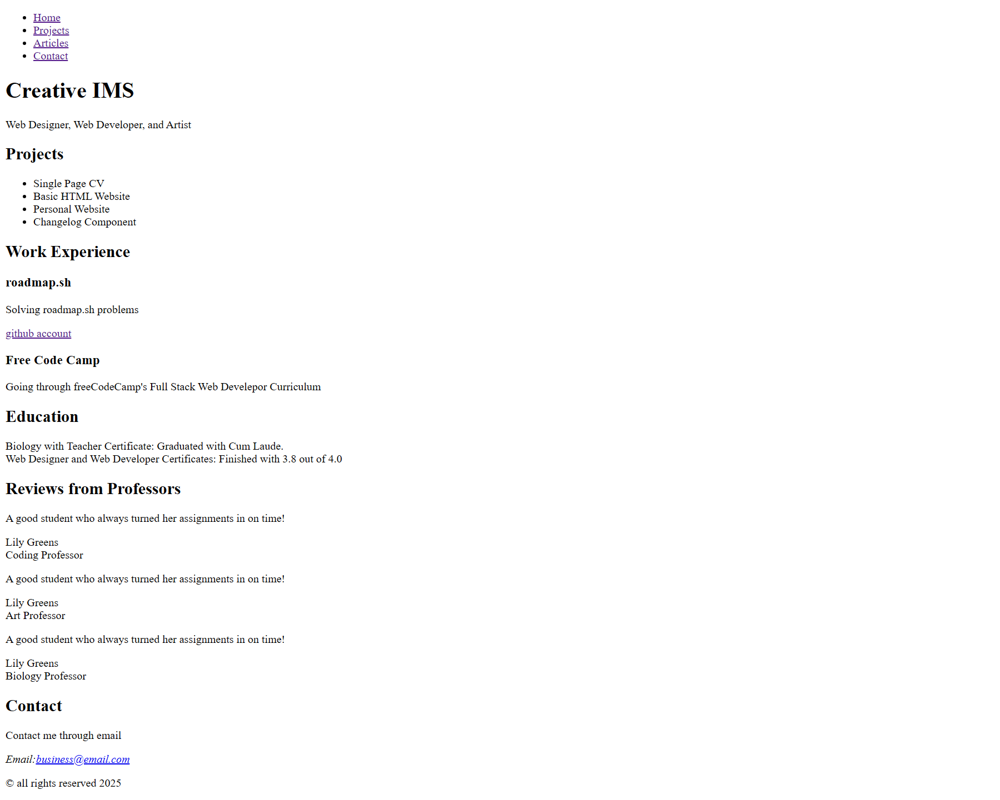
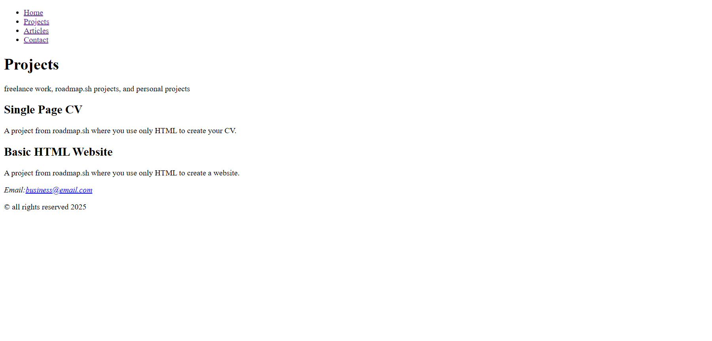

# Basic HTML Website

## Description
In this project, you are required to create a simple HTML only website with multiple pages.

- [x] Semantically correct HTML structure.
- [x] Multiple pages with a navigation bar.
    - [x] Homepage
    - [x] Projects
    - [x] Articles
    - [x] Contact
- [x] SEO meta tags in the head of each page.
- [x] Contact page should have a form with fields like name, email, message etc.
- [x] Structure in a way that you can easily add styles later.
