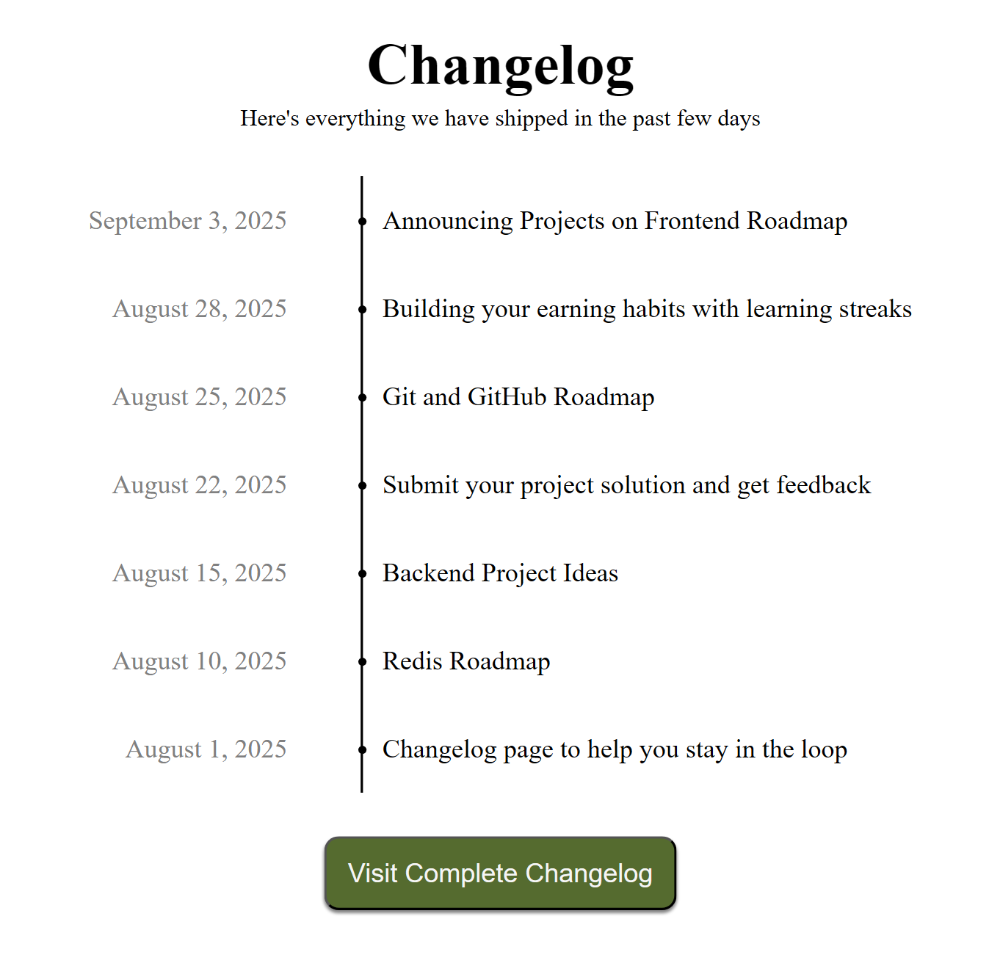

# Changelog Component

## Description
In this project you are required to create a simple component for a website that displays a changelog. You will create a simple HTML structure and use CSS to style it into a visually appealing and responsive changelog component.

The focus should be on creating a well-structured and responsive component that can be easily integrated into a website.
