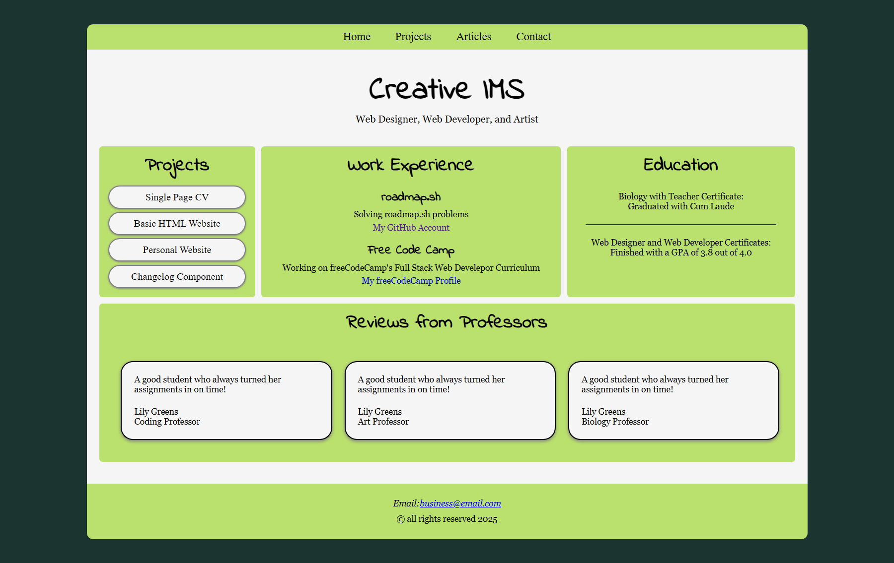
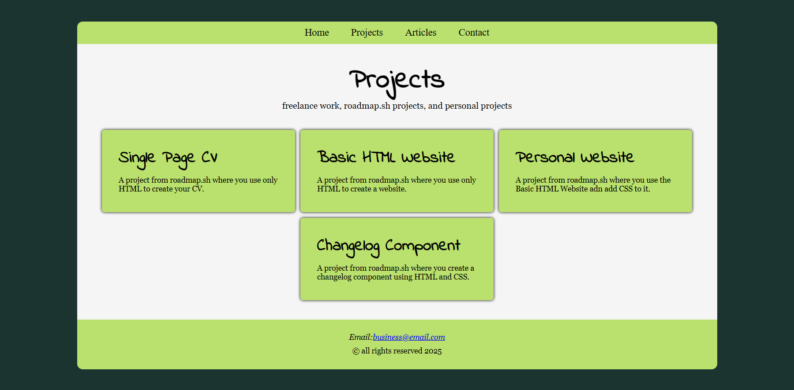
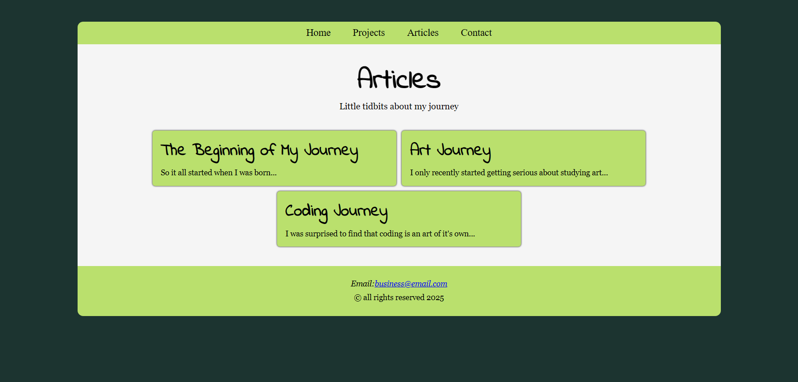
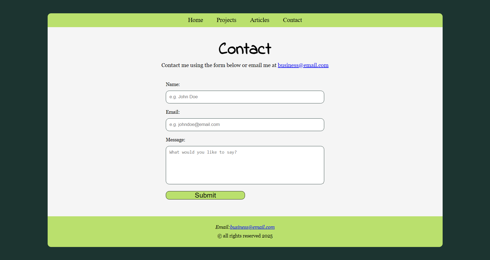

# Personal Portfolio

## Description
In this project, you will style the HTML website structure you created previously in a different project. The focus will be on learning how to use CSS to create responsive layouts, apply color and typography, and enhance the overall design of your website.

Your submission should include:
- [x] A fully styled, responsive website with the same structure as the previous project.
- [x] Consistent use of a chosen color scheme and typography.
- [x] Proper use of CSS techniques like Flexbox, media queries, and the box model.
- [x] A responsive navigation bar and well-styled contact form.

For bonus points, you can:
- [x] Use Google Fonts to enhance the typography of your website.
- [ ] Look into GitHub Pages or Cloudflare Pages to host your website for free.
- [ ] Add support for dark mode using CSS variables.