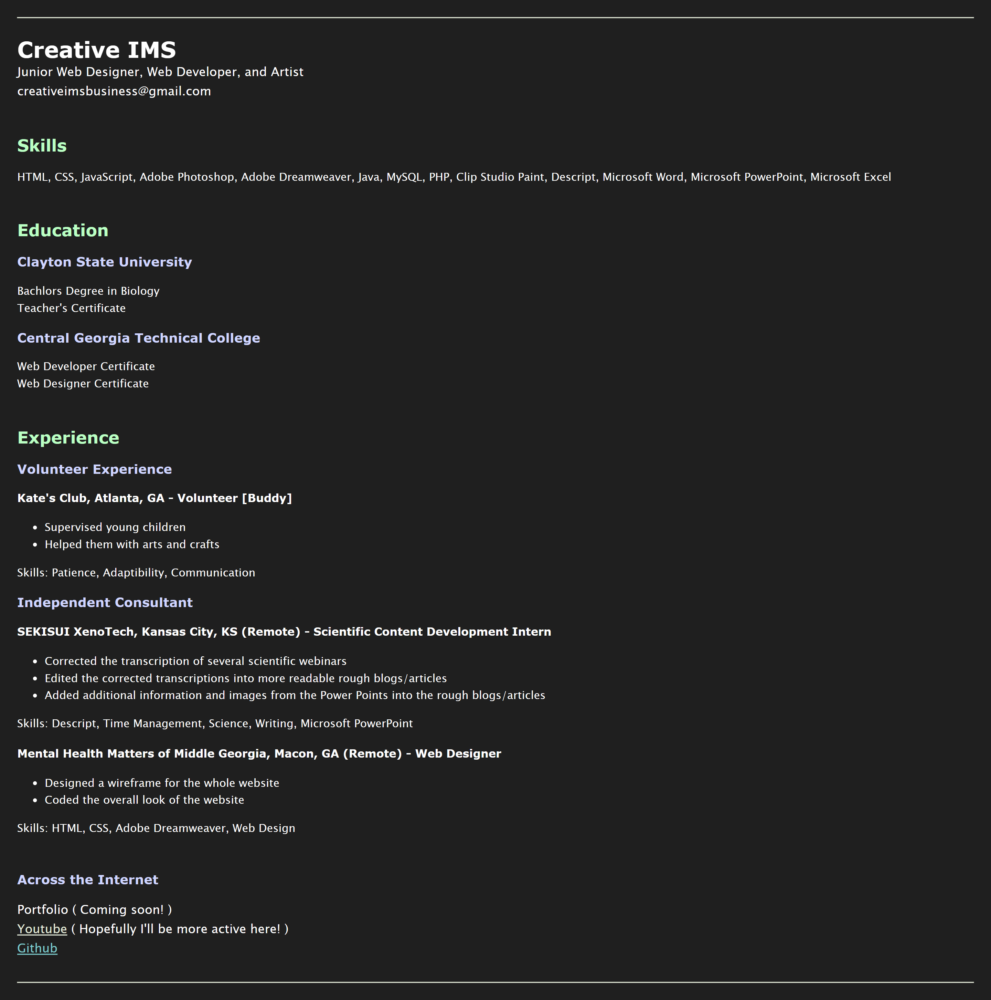

# Single Page CV

## Description
In this project, you are required to create a single-page CV (Curriculum Vitae) using only HTML.

Submission Checklist:

- [x] Semantically correct HTML structure.
- [x] Single-page layout with sections for education, skills, and career history.
- [x] SEO meta tags in the head section.
- [x] OG tags for better social media sharing.
- [x] A favicon linked in the head section.
- [x] The structure of your CV should be easily understandable and ready for styling in a future project.
